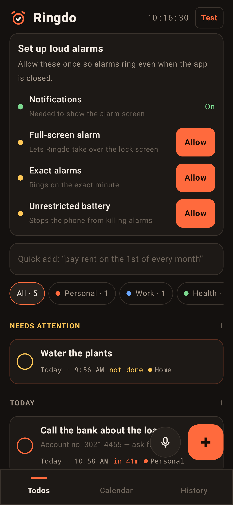
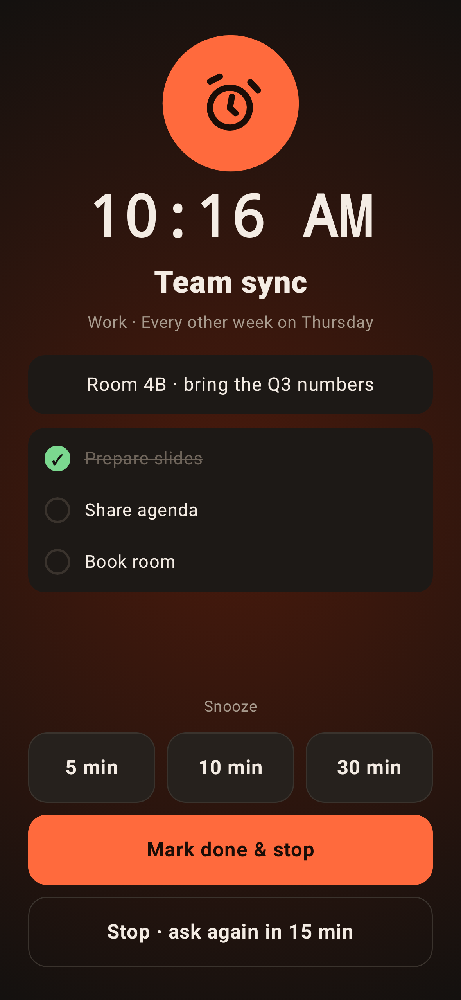
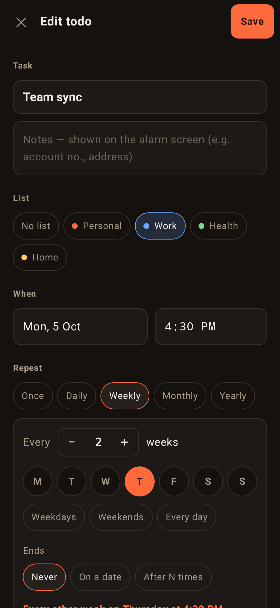
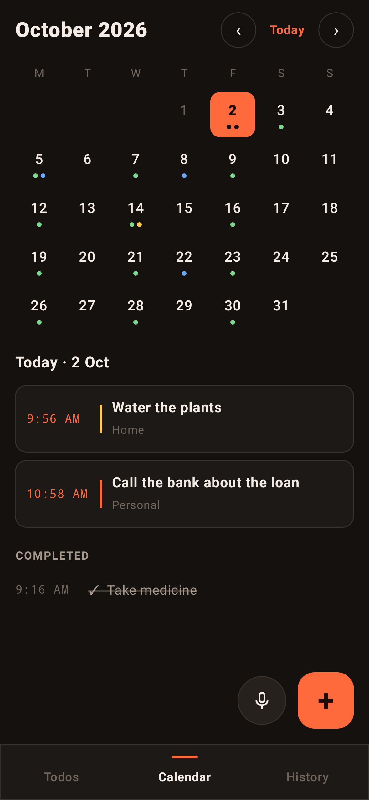
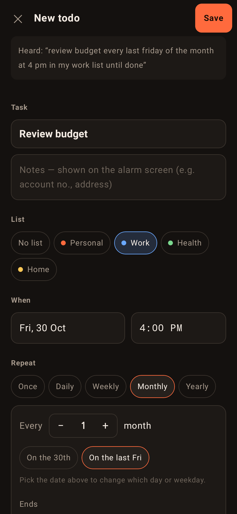
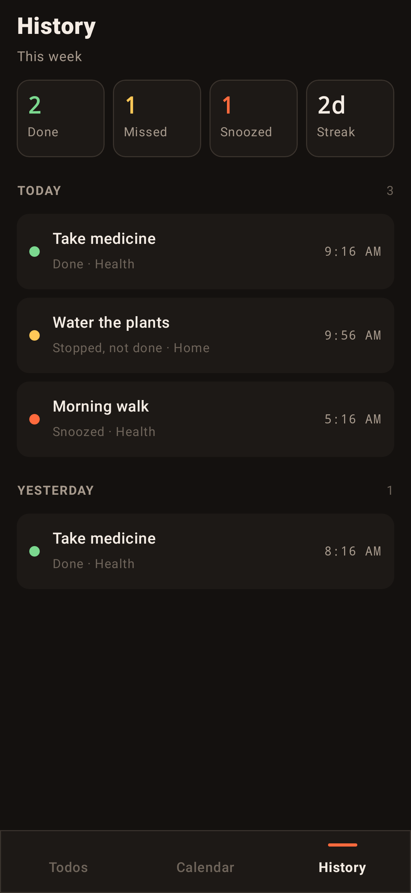

<p align="center">
  
</p>

<h1 align="center">Ringdo</h1>

<p align="center">
  <b>Todos that ring like an alarm clock. Not just a notification.</b><br>
  A native Android app that turns every task into a real alarm: full-screen, loud, looping and persistent until you deal with it.
</p>

<p align="center">
  
  
  
  
  
</p>

---

## Why Ringdo?

Most todo apps fire a single notification that's easy to miss or swipe away. Ringdo treats important tasks the way your phone treats a wake-up alarm:

- It **rings on the exact minute**, using the same `AlarmManager.setAlarmClock()` API as the system Clock app.
- It **takes over the lock screen** and turns the screen on.
- It **plays on the alarm stream**, so it rings even when the phone is on silent. It starts softer and gets louder over about 25 seconds.
- It **vibrates continuously** and keeps ringing until you snooze, stop or complete it.
- **Nag mode** brings the alarm back every few minutes until the task is actually done.

<p align="center">
  
  
  
  
</p>

## Features

### Alarms that actually work
| | |
|---|---|
| Exact timing | `setAlarmClock()`: exempt from Doze, shows the alarm icon in the status bar |
| Lock-screen takeover | Full-screen intent and `showWhenLocked` / `turnScreenOn` |
| Loud on silent | `USAGE_ALARM` audio, raises a too-low alarm volume to 70% while ringing, then restores it |
| Escalating volume | Ramps from 35% to 100% over about 25 seconds |
| Persistent | Loops sound and vibration until you act; auto-snoozes after 10 minutes |
| Survives reboot | Alarms are re-registered after boot (including before first unlock), app updates and time-zone changes |
| Per-todo tone | Use the phone's alarm tone or pick any ringtone |

### Smart repeats
- Any days of the week: *every Thursday*, *Mon/Wed/Fri*, weekdays, weekends
- Every N days, weeks, months or years: *every other Thursday*, *every 3 days*
- Monthly by date (*the 1st*), Nth weekday (*2nd Tuesday*) or last weekday (*last Friday*)
- Yearly, with sensible handling of the 31st and 29 February
- Ends never, on a date, or after N times
- Skip the next occurrence without breaking the pattern

### Nag mode
"Stop" only pauses the alarm. It rings again after 5, 10, 15, 30 or 60 minutes until you tap **Done**.

### Voice and natural-language entry
Tap the mic, or type into quick add:

```
call the bank tomorrow at 10
gym every monday wednesday and friday at 6 am
pay rent on the 1st of every month #home
take medicine every day at 9 pm until done        → nag mode on
team call every other thursday at 4:30 pm in my work list
review budget every last friday of the month at 4 pm
in 20 minutes check the oven
passport renewal 5/11 at 10am                     → dd/mm
```

### Organise
- **Lists** with colours (Personal, Work, Health, Home, plus your own), and filter chips
- **Checklists** inside a todo, tickable from the alarm screen, reset on each repeat
- **Notes** shown on the ringing screen, such as an account number or address
- **Calendar** month view with per-list dots, including future repeat occurrences
- **History** of what was done, missed or snoozed, weekly stats and a daily streak
- **Swipe** right to complete, left to delete, with undo; tap a todo to edit it

<p align="center">
  
  
</p>

## Install

Download [`releases/Ringdo-1.1.apk`](releases/Ringdo-1.1.apk) (open it, then tap **Download raw file**), open it on your Android phone and allow installs from that source when asked. Release notes are under [Releases](../../releases).

On first launch, tap **Allow** on each item in the setup card: notifications, full-screen alarm, exact alarms and unrestricted battery. Then tap **Test** and lock your phone. It rings in 10 seconds.

> **Xiaomi, Oppo, Vivo or Realme:** also enable *Autostart* for Ringdo in system settings, or the phone may block alarms in the background.

## Build from source

Requirements: JDK 17 and the Android SDK (platform 35, build-tools 35).

```bash
cd android
./gradlew testDebugUnitTest     # 30 logic tests + 6 screenshot tests
./gradlew assembleDebug         # → app/build/outputs/apk/debug/
```

### Release builds
Create `android/keystore.properties` (see `keystore.properties.example`) pointing at your signing key, then:

```bash
./gradlew assembleRelease       # signed, minified APK
```

> Keep your keystore safe and **never commit it**. Updates must be signed with the same key. Both `*.jks` and `keystore.properties` are already in `.gitignore`.

Screenshot tests (Robolectric with Roborazzi) render each screen off-device to `android/app/build/screenshots/`.

## Project structure

```
android/                     Native Android app (Kotlin + Jetpack Compose)
  app/src/main/java/app/ringdo/
    Model.kt                 Todo / Rule / List models, recurrence engine, state transitions
    Parser.kt                Natural-language parser for voice and quick add
    Store.kt                 JSON persistence (device-protected storage), 1.0 → 1.1 migration
    Alarms.kt                AlarmManager scheduling, boot and alarm receivers
    AlarmService.kt          Foreground service: looping alarm audio, vibration, notification
    AlarmActivity.kt         Full-screen ringing screen (shows over the lock screen)
    MainActivity.kt          Todos, Calendar, History and Lists screens
    Editor.kt                Add/edit screen: repeats, nag, checklist, sound
    Ui.kt                    Theme and shared components
  app/src/test/              Unit tests (recurrence and parser) and screenshot tests
releases/                    Signed APKs
web/                         Original PWA prototype (rings only while the tab is open)
docs/                        Logo and screenshots
```

## How it works

```
Add todo ──► AlarmScheduler.schedule()
               └─ AlarmManager.setAlarmClock(time, AlarmReceiver)
                                      │  (fires exactly, even in Doze)
                                      ▼
                       AlarmReceiver ──► AlarmService (foreground)
                                          ├─ MediaPlayer on the ALARM stream, looping and ramping
                                          ├─ continuous vibration
                                          └─ full-screen notification ──► AlarmActivity
                                                                         [Snooze] [Done] [Stop]
                                                                                │
                              Actions.complete / snooze / stop ◄────────────────┘
                              (next occurrence, nag re-ring, history log)
```

The recurrence engine and parser in `Model.kt` and `Parser.kt` are pure Kotlin with `java.time`, with no Android dependencies, so they're fully unit-tested on the JVM.

## Permissions

| Permission | Why |
|---|---|
| `USE_EXACT_ALARM` / `SCHEDULE_EXACT_ALARM` | Ring on the exact minute |
| `USE_FULL_SCREEN_INTENT` | Show the alarm over the lock screen |
| `FOREGROUND_SERVICE_MEDIA_PLAYBACK` | Keep the alarm sound playing |
| `POST_NOTIFICATIONS` | Show the alarm notification |
| `RECEIVE_BOOT_COMPLETED` | Restore alarms after a restart |
| `REQUEST_IGNORE_BATTERY_OPTIMIZATIONS` | Stop aggressive battery savers from killing alarms |
| `VIBRATE`, `WAKE_LOCK`, `MODIFY_AUDIO_SETTINGS` | Vibrate, stay awake while ringing, ensure audible volume |

All data stays on the device. Ringdo has no account, no network access and no tracking.

## Roadmap

- [ ] Backup and restore (file / Google Drive)
- [ ] Home-screen widget
- [ ] Hindi and Telugu voice entry
- [ ] Pro upgrade with Google Play Billing
- [ ] Shared alarms for family members
- [ ] iOS version using AlarmKit (iOS 26)

---

<p align="center">Made in Hyderabad.</p>
